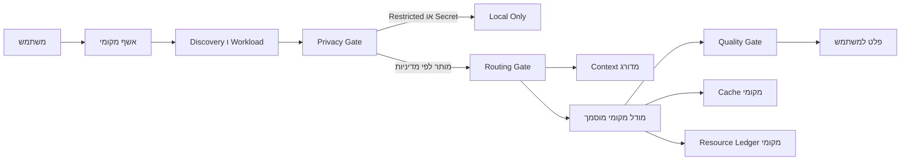

# זרימת מידע

Metadata רשמי של גרסאות ורישיונות יכול להישלף רק לאחר בדיקת HTTPS ו־Allowlist. תוכן משתמש אינו נשלח בזרימת השיפור. אין Telemetry כברירת מחדל.

התזמון המקומי מפעיל בדיקת Metadata בלבד ברמת המשתמש ורק לאחר Opt In. הוא אינו יוצר Listener ואינו מעביר מזהה חומרה ייחודי. Canary יורד רק לאחר אישור מפורש לתיקייה מבודדת. Production משתנה רק לאחר אישור קידום נפרד.

זרימת השיפור היא: Source Registry רשמי, Metadata בלבד, Deduplication ו־Cooldown, License ו־CVE, Hardware ו־Memory Fit, אישור Canary, הורדה מבודדת, אימות Hash וגודל, Benchmark מול Baseline, אישור Promotion, Backup אטומי ו־Last Known Good. תוכן משתמש אינו משתתף בזרימה.

